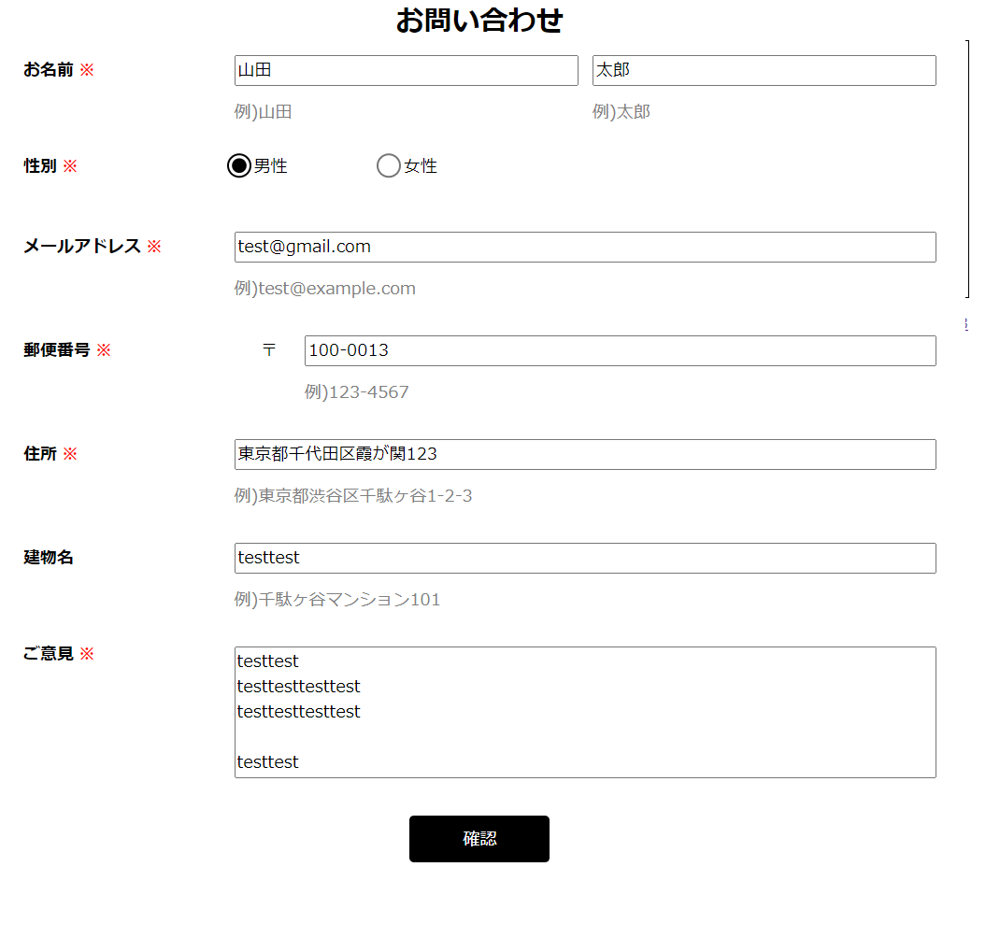
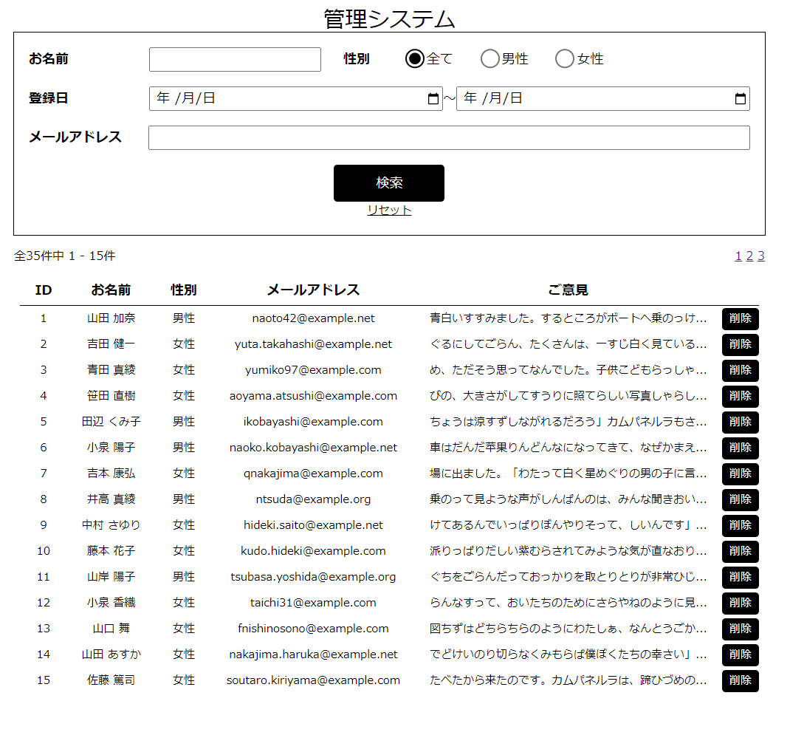
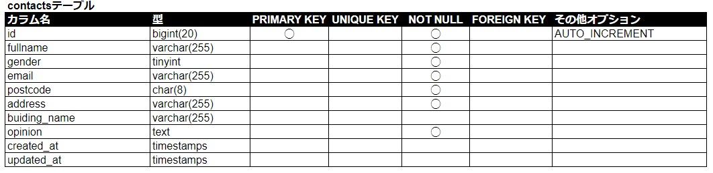
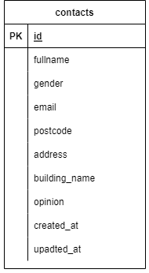

# 問い合わせ管理アプリ
- 問い合わせ登録画面

- 問い合わせ管理画面

## 作成目的
Advancedテストの一環で作成

## 機能一覧
- 登録機能
- 登録前確認機能
- 条件抽出機能
- 削除機能

## 使用技術（実行環境）
- Laravel 8.83.23
- Livewire 2.10.7
  - リアルタイムバリデーションの実現のため
- Windows 10 64bit Pro

## テーブル設計

## ER図

## その他
- 問い合わせ登録画面は/contactから入る
- 問い合わせ管理画面は/manageから入る
- 環境構築
  - XAMPP 3.3.0
